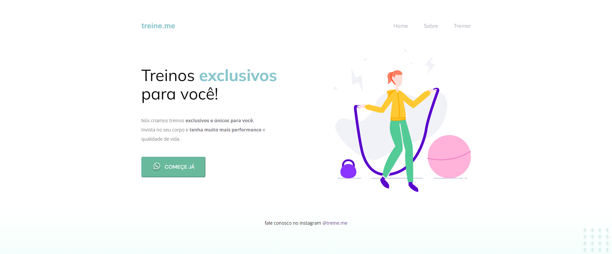

# Rocketseat Explorer - Stage 02 Projeto 02

Projeto de uma página fictícia de exercícios, construído no curso Explorer da Rocketseat

[Clique aqui para acessar](https://buucocs.github.io/expl-stg2-mdl2-projeto2/)

## Tecnologias

- HTML
- CSS
- Git e Github

## Contato

- contato@leonardohgomes.com.br
- @leonardohgomes_
- https://github.com/Buucocs